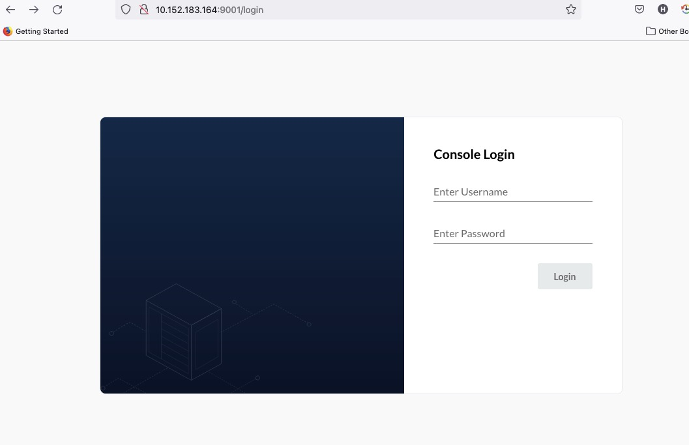

======
MinIO
======

--------
Overview
--------

MinIO is an object storage solution that provides an Amazon Web Services S3-compatible API and supports all core S3 features. MinIO is built to deploy anywhere - public or private cloud, baremetal infrastructure, orchestrated environments, and edge infrastructure. Please see more details from `MinIO <https://min.io/docs/minio/kubernetes/upstream/>`__.

Since Kubeflow has already setup a MinIO, we will discusse MinIO with `external identity management <https://min.io/docs/minio/kubernetes/upstream/operations/external-iam.html>`__.

In this guide, we will cover following contents:

* Authentication and authorization
    * LDAP (Lightweight Directory Access Protocol)
    * OIDC (OpenID Connect) **TODO**

-------------
Prerequisites
-------------

* You have already installed Kubeflow on your cluster.

* You have installed `MinIO <https://min.io/docs/minio/kubernetes/upstream/index.html>`__  operator.

* You can access the MinIO dashboard.

* The MinIO Client ``mc`` command line tool installed. You may refer the `MinIO client documentation <https://min.io/docs/minio/linux/reference/minio-mc.html>`_.

* You have deployed `LDAP service and add record user <https://medium.com/rahasak/deploy-ldap-directory-service-with-openldap-docker-8d9f438f1216>`__.

--------------------------------
Authentication and authorization
--------------------------------

MinIO can integrate with a number of OmniAuth providers and external authentication and authorization providers. In this documentation, 
we would introduce you to how to integrate your deployed MinIO with:

* LDAP (an external authentication provider)
* OIDC (OmniAuth providers) **TODO**

^^^^^^^^^^^^^^
Integrate LDAP
^^^^^^^^^^^^^^

MinIO supports using an Active Directory or LDAP (AD/LDAP) service for external management of user identities. Configuring an external IDentity Provider (IDP) enables Single-Sign On (SSO) workflows, where applications authenticate against the external IDP before accessing MinIO. More details can be found from `LDAP service <https://min.io/docs/minio/kubernetes/upstream/operations/external-iam.html#querying-the-active-directory-ldap-service>`__.

There is 2 options to set LDAP Configuration. one is edit `minio` `statefulset` to add environment variables, another is use MinIO server runtime configuration settings to configure. Both methods require starting/restarting the MinIO deployment to apply changes. And Both methods could be found from `configure MinIO for Authentication using LDAP <https://min.io/docs/minio/windows/operations/external-iam/configure-ad-ldap-external-identity-management.html#procedure>`__.
The following provide a quick reference of all required and optional environment variables and configuration settings respectively.

You can choose the one of options to enable LDAP for MinIO. 

"""""""""""""""""""""""""""""""""""""""""""""""""""""""""""""
Option1: Using environment variables to enable LDAP for MinIO
"""""""""""""""""""""""""""""""""""""""""""""""""""""""""""""

Firstly you need to obtatin parameters of LDAP service, including LDAP server host for ``MINIO_IDENTITY_LDAP_SERVER_ADDR``, Bind DN account for ``MINIO_IDENTITY_LDAP_LOOKUP_BIND_DN``, Password of the bind DN account for ``MINIO_IDENTITY_LDAP_LOOKUP_BIND_PASSWORD``, Base dn for search for ``MINIO_IDENTITY_LDAP_USER_DN_SEARCH_BASE_DN``, Search query filed for ``MINIO_IDENTITY_LDAP_USER_DN_SEARCH_FILTER``.

Secondly update `environment variables <https://min.io/docs/minio/linux/reference/minio-server/minio-server.html#minio-server-envvar-external-identity-management-ad-ldap>`__ for MinIO configuration using LDAP service parameters. Add the value of below MinIO environment variables in MinIO statefulset.

.. code-block:: shell

    $ microk8s kubectl edit statefulset minio -n kubeflow
    ...
    env:
        ...
        - name: MINIO_IDENTITY_LDAP_SERVER_ADDR
          value: <your_ldap_server_host_ip>:389
        - name: MINIO_IDENTITY_LDAP_LOOKUP_BIND_DN
          value: "cn=xxxxx,dc=xxxxx,dc=xxxxx"
        - name: MINIO_IDENTITY_LDAP_LOOKUP_BIND_PASSWORD
          value: "xxxxxxx"
        - name: MINIO_IDENTITY_LDAP_USER_DN_SEARCH_BASE_DN
          value: "dc=xxxxx,dc=xxxxx"
        - name: MINIO_IDENTITY_LDAP_USER_DN_SEARCH_FILTER
          value: "(uid=%s)"
        - name: MINIO_IDENTITY_LDAP_TLS_SKIP_VERIFY
          value: "on"
        - name: MINIO_IDENTITY_LDAP_SERVER_STARTTLS
          value: "on"

When you quit and save statefulset, the corresponding pod will restart automatically. 

"""""""""""""""""""""""""""""""""""""""""""""""""""""""""""""""
Option2: Using server runtime settings to enable LDAP for MinIO
"""""""""""""""""""""""""""""""""""""""""""""""""""""""""""""""

MinIO supports specifying the LDAP provider settings using `configuration settings <https://min.io/docs/minio/linux/reference/minio-mc-admin/mc-admin-config.html#mc-conf.identity_ldap>`__.  For distributed deployments, the ``mc admin config`` command applies the configuration to all nodes in the deployment.

Firstly set `alias <https://min.io/docs/minio/linux/reference/minio-mc/mc-alias.html>`__ with the specified username and password for authenticating to the MinIO deployment.

Secondly setting configuration related to configuring an LDAP provider for external identity management, there is the example code as follow:

.. code-block:: shell

    mc admin config set mlflow-minio identity_ldap \
        server_addr="<your_ldap_server_host_ip>:389" \
        lookup_bind_dn="cn=xxxxx,dc=xxxxx,dc=xxxxx" \
        lookup_bind_password="xxxxxxx" \
        user_dn_search_base_dn="dc=xxxxx,dc=xxxxx" \
        user_dn_search_filter="uid=%s" \
        tls_skip_verify="on" \
        server_starttls="on"

This setting don't restart MinIO deployment automatically, you need to use the `mc admin service restart <https://min.io/docs/minio/linux/reference/minio-mc-admin/mc-admin-service.html#mc.admin.service.restart>`__ command to restart the deployment.``

.. code-block:: shell

    mc admin service restart ALIAS

Replace ALIAS with the `alias <https://min.io/docs/minio/linux/reference/minio-mc/mc-alias-set.html#alias>`__ of the deployment to restart.

"""""""""""""""""""""""""""""""""""""""""""""
Set policy for LDAP users to access resources
"""""""""""""""""""""""""""""""""""""""""""""

MinIO by default denies access to all actions or resources not explicitly allowed by a user’s assigned or inherited `policies <https://min.io/docs/minio/linux/administration/identity-access-management/policy-based-access-control.html#minio-policy>`__. Users managed by an AD/LDAP provider must specify the necessary policies as part of the user profile data. If no policies match either the user DN or group DNs, MinIO blocks all access to actions and resources on the deployment.

Before log into the MinIO Console using the LDAP-managed user credentials, need to `map policies to user DN <https://min.io/docs/minio/linux/administration/identity-access-management/ad-ldap-access-management.html>`__.

You can wirte policy as beflow to access all MinIO resources. Also assign ``consoleAdmin``, ``readwrite`` and other policies to LDAP users.

.. code-block:: shell

    cat allaccess.json
    {
    "Statement": [
        {
        "Resource": [
            "arn:aws:s3:::*"
        ],
        "Action": [
            "s3:*"
        ],
        "Effect": "Allow"
        }
    ],
    "Version": "2012-10-17"
    }

Add the newly policy to MinIO server and check all policies by ``mc admin policy list``.

.. code-block:: shell

    # add policy
    ./mc admin policy add ALIAS allaccess allaccess.json

    # list all policy
    mc admin policy list ALIAS

Assign the policy to LDAP users.

.. code-block:: shell

    mc admin policy set mlminio allaccess user='uid=amy,dc=rahasak,dc=com'
    mc admin policy set mlminio readonly user='uid=zyajing,dc=rahasak,dc=com'
    mc admin policy set mlminio readonly user='uid=bob,dc=rahasak,dc=com'

* MinIO would assign an authenticated user with DN matching ``uid=amy,dc=rahasak,dc=com`` the allaccess policy to allow access all resources, granting complete access to the MinIO server.

* MinIO would assign an authenticated user with DN matching ``uid=zyajing,dc=rahasak,dc=com`` the `consoleAdmin <https://min.io/docs/minio/linux/administration/identity-access-management/policy-based-access-control.html#minio-policy>`__ policy, granting complete access to the MinIO server.

* MinIO would assign an authenticated user with DN matching ``uid=bob,dc=rahasak,dc=com`` the `readwrite <https://min.io/docs/minio/linux/administration/identity-access-management/policy-based-access-control.html#minio-policy>`__ policies, granting general read/write access to the MinIO server.

""""""""""""""""""""""""""""""""""""""""""
Login MinIO console using LDAP credentials
""""""""""""""""""""""""""""""""""""""""""

Let's get MinIO console URL to login.

.. code-block:: shell

    $ microk8s kubectl get svc minio  -n kubeflow
    NAME    TYPE        CLUSTER-IP       EXTERNAL-IP   PORT(S)             AGE
    minio   ClusterIP   10.152.183.164   <none>        9000/TCP,9001/TCP   5d4h

You can access the Console for the MinIO cluster. For example, https://10.152.183.164:9000.

Use your LDAP user's account and password to login MinIO console.

^^^^^^^^^^^^^^
Integrate OIDC
^^^^^^^^^^^^^^

**TODO**

------------------
Disable MinIO LDAP
------------------

If you want to disable MinIO LDAP, login MinIO console using static account before. Just run the beflow command.

.. code-block:: shell

    $ ./mc admin config reset ALIAS/ identity_ldap
    Key is successfully reset.
    Please restart your server with `mc admin service restart ALIAS/`.

    $ ./mc admin service restart ALIAS/
    Restart command successfully sent to `ALIAS/`. Type Ctrl-C to quit or wait to follow the status of the restart process.
    ...
    Restarted `ALIAS/` successfully in 1 seconds
 

-----------------------------
Disable MinIO identity_openid
-----------------------------

If you want to disable MinIO OIDC, login MinIO console using static account before. Just run the beflow command.

.. code-block:: shell

    $ ./mc admin config reset ALIAS/ identity_openid
    Key is successfully reset.
    Please restart your server with `mc admin service restart ALIAS/`.

    $ ./mc admin service restart ALIAS/
    Restart command successfully sent to `ALIAS/`. Type Ctrl-C to quit or wait to follow the status of the restart process.
    ...
    Restarted `ALIAS/` successfully in 1 seconds
