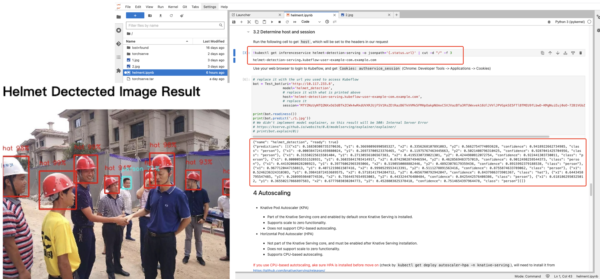

.. _helmet-kserve:

==================================
Model Serving with Kubeflow KServe
==================================

-----------
Intrduction
-----------

The InferenceService custom resource is the primary interface that is used for deploying models on KServe. 
Inside an InferenceService, users can specify multiple components that are used for handling inference requests. 
These components are the predictor, transformer, and explainer. 
For more detailed documentation on Kubeflow KServe, refer to `KServe <https://kserve.github.io/website/0.7/modelserving/data_plane/>`__.

In this tutorial, you will deploy an InferenceService with a predictor that will load a Helemt Detection Yolov5 model trained with custom dataset, 
which the fine-tuning process is shown at the above experiment. 

You will then send an inference request to your deployed model in order to get a detection the presence of helmets on individuals your request corresponds to.

--------
Workflow
--------

The session mainly covers:

* PyTorch Serve: package PyTorch model with custom preprocess/postprocess functions
* MinIO storage usage
* KServe: inferenceservice, autoscaling, canary rollout

    .. image:: ../_static/helmet-kserve-01.png

^^^^^^^^^^^^^
PyTorch Serve
^^^^^^^^^^^^^

Learn more about torchscript here: `TorchScript <https://pytorch.org/tutorials/beginner/deploy_seq2seq_hybrid_frontend_tutorial.html/>`__.

"""""""""""""""""""""""""""""
Prepartion for Model Archiver
"""""""""""""""""""""""""""""

Firstly, we need to prepare 3 files:

* helmet.pt: fine-tuning the model with your own data and save the parameters
* helmet.torchscript.pt: a serialized file (.pt or .pth) should be a checkpoint in case of torchscript and state_dict in case of eager mode.
* handler.py: codes for model initialization, pre-processing, post-processing, etc.

.. code-block:: python

    """Custom TorchServe model handler for YOLOv5 models (model_handler.py)
       BaseHandler: https://github.com/pytorch/serve/blob/master/ts/torch_handler/base_handler.py
    """

    from ts.torch_handler.base_handler import BaseHandler
    import numpy as np
    import base64
    import torch
    import torchvision.transforms as tf
    import torchvision
    import io
    from PIL import Image
    import warnings

    class ModelHandler(BaseHandler):
        """
        A custom model handler implementation.
        """

        img_size = 640
        """Image size (px). Images will be resized to this resolution before inference.
        """

        def __init__(self):
            # call superclass initializer
            super().__init__()
            self._context = None
            self.initialized = False
            self.batch_size = 1
            self.img_size = 640

        def preprocess(self, data):
            """Converts input images to float tensors.
            Args:
                data (List): Input data from the request in the form of a list of image tensors.
            Returns:
                Tensor: single Tensor of shape [BATCH_SIZE, 3, IMG_SIZE, IMG_SIZE]
            """
            images = []

            transform = tf.Compose([
                tf.ToTensor(),
                tf.Resize((self.img_size, self.img_size))
            ])

            # Method 1
            # image = data[0].get("data") or data[0].get("body")
            image = data[0]

            if image is None:
                warnings.warn("data params is none")
                raise Exception("no data")
            else:
                if isinstance(image, str):
                    # if the image is a string of bytesarray.
                    image = base64.b64decode(image)

                # If the image is sent as bytesarray
                if isinstance(image, (bytearray, bytes)):
                    image = Image.open(io.BytesIO(image))
                else:
                    # if the image is a list
                    image = torch.FloatTensor(image)

                # force convert to tensor
                # and resize to [img_size, img_size]
                image = transform(image)

                images.append(image)

            # convert list of equal-size tensors to single stacked tensor
            # has shape BATCH_SIZE x 3 x IMG_SIZE x IMG_SIZE
            images_tensor = torch.stack(images).to(self.device)

            return images_tensor

        def postprocess(self, inference_output):
            # perform NMS (nonmax suppression) on model outputs
            pred = non_max_suppression(inference_output[0])

            # initialize empty list of detections for each image
            detections = [[] for _ in range(len(pred))]

            for i, image_detections in enumerate(pred):  # axis 0: for each image
                for det in image_detections:  # axis 1: for each detection
                    # x1,y1,x2,y2 in normalized image coordinates (i.e. 0.0-1.0)
                    xyxy = det[:4] / self.img_size
                    # confidence value
                    conf = det[4].item()
                    # index of predicted class
                    class_idx = int(det[5].item())
                    # get label of predicted class
                    # if missing, then just return class idx
                    label = self.mapping.get(str(class_idx), class_idx)

                    detections[i].append({
                        "x1": xyxy[0].item(),
                        "y1": xyxy[1].item(),
                        "x2": xyxy[2].item(),
                        "y2": xyxy[3].item(),
                        "confidence": conf,
                        "class": label
                    })

            # format each detection
            return detections

    def non_max_suppression(prediction, conf_thres=0.25, iou_thres=0.45, classes=None, agnostic=False, multi_label=False,
                            labels=(), max_det=300):
        """Runs Non-Maximum Suppression (NMS) on inference results
        Returns:
            list of detections, on (n,6) tensor per image [xyxy, conf, cls]
        """

        nc = prediction.shape[2] - 5  # number of classes
        xc = prediction[..., 4] > conf_thres  # candidates

        # Checks
        assert 0 <= conf_thres <= 1, f'Invalid Confidence threshold {conf_thres}, valid values are between 0.0 and 1.0'
        assert 0 <= iou_thres <= 1, f'Invalid IoU {iou_thres}, valid values are between 0.0 and 1.0'

        # Settings
        # (pixels) minimum and maximum box width and height
        min_wh, max_wh = 2, 4096
        max_nms = 30000  # maximum number of boxes into torchvision.ops.nms()
        time_limit = 10.0  # seconds to quit after
        redundant = True  # require redundant detections
        multi_label &= nc > 1  # multiple labels per box (adds 0.5ms/img)
        merge = False  # use merge-NMS

        output = [torch.zeros((0, 6), device=prediction.device)
                ] * prediction.shape[0]
        for xi, x in enumerate(prediction):  # image index, image inference
            # Apply constraints
            # x[((x[..., 2:4] < min_wh) | (x[..., 2:4] > max_wh)).any(1), 4] = 0  # width-height
            x = x[xc[xi]]  # confidence

            # Cat apriori labels if autolabelling
            if labels and len(labels[xi]):
                l = labels[xi]
                v = torch.zeros((len(l), nc + 5), device=x.device)
                v[:, :4] = l[:, 1:5]  # box
                v[:, 4] = 1.0  # conf
                v[range(len(l)), l[:, 0].long() + 5] = 1.0  # cls
                x = torch.cat((x, v), 0)

            # If none remain process next image
            if not x.shape[0]:
                continue

            # Compute conf
            x[:, 5:] *= x[:, 4:5]  # conf = obj_conf * cls_conf

            # Box (center x, center y, width, height) to (x1, y1, x2, y2)
            box = xywh2xyxy(x[:, :4])

            # Detections matrix nx6 (xyxy, conf, cls)
            if multi_label:
                i, j = (x[:, 5:] > conf_thres).nonzero(as_tuple=False).T
                x = torch.cat((box[i], x[i, j + 5, None], j[:, None].float()), 1)
            else:  # best class only
                conf, j = x[:, 5:].max(1, keepdim=True)
                x = torch.cat((box, conf, j.float()), 1)[
                    conf.view(-1) > conf_thres]

            # Filter by class
            if classes is not None:
                x = x[(x[:, 5:6] == torch.tensor(classes, device=x.device)).any(1)]

            # Apply finite constraint
            # if not torch.isfinite(x).all():
            #     x = x[torch.isfinite(x).all(1)]

            # Check shape
            n = x.shape[0]  # number of boxes
            if not n:  # no boxes
                continue
            elif n > max_nms:  # excess boxes
                # sort by confidence
                x = x[x[:, 4].argsort(descending=True)[:max_nms]]

            # Batched NMS
            c = x[:, 5:6] * (0 if agnostic else max_wh)  # classes
            # boxes (offset by class), scores
            boxes, scores = x[:, :4] + c, x[:, 4]
            i = torchvision.ops.nms(boxes, scores, iou_thres)  # NMS
            if i.shape[0] > max_det:  # limit detections
                i = i[:max_det]
            if merge and (1 < n < 3E3):  # Merge NMS (boxes merged using weighted mean)
                # update boxes as boxes(i,4) = weights(i,n) * boxes(n,4)
                iou = torchvision.box_iou(
                    boxes[i], boxes) > iou_thres  # iou matrix
                weights = iou * scores[None]  # box weights
                x[i, :4] = torch.mm(weights, x[:, :4]).float(
                ) / weights.sum(1, keepdim=True)  # merged boxes
                if redundant:
                    i = i[iou.sum(1) > 1]  # require redundancy

            output[xi] = x[i]

        return output

    def xywh2xyxy(x):
        # Convert nx4 boxes from [x, y, w, h] to [x1, y1, x2, y2] where xy1=top-left, xy2=bottom-right
        y = x.clone() if isinstance(x, torch.Tensor) else np.copy(x)
        y[:, 0] = x[:, 0] - x[:, 2] / 2  # top left x
        y[:, 1] = x[:, 1] - x[:, 3] / 2  # top left y
        y[:, 2] = x[:, 0] + x[:, 2] / 2  # bottom right x
        y[:, 3] = x[:, 1] + x[:, 3] / 2  # bottom right y
        return y

"""""""""""""""""""""""""
Torchserve Model Archiver
"""""""""""""""""""""""""
It basically create a tar called {model-name}.mar from model-file, serialized-file, handler

.. code-block:: bash

    %%bash
    cd $(dirname $0)/torchserve
    base_path=$(pwd)

    mkdir -p $base_path/model-store && cd $base_path/model-store &&
    if [ -f $base_path/model-store/helmet_detection.mar ]; then
        rm $base_path/model-store/helmet_detection.mar
    fi

    pip install torch-model-archiver -i https://pypi.tuna.tsinghua.edu.cn/simple

    torch-model-archiver --model-name helmet_detection \
    --version 0.1 --serialized-file $base_path/helmet.torchscript.pt \
    --handler $base_path/torchserve_handler.py \
    --extra-files $base_path/index_to_name.json,$base_path/torchserve_handler.py

    echo "create successfully"

The more detailed instruction you can refer to `helmet_yolov5_torchserve <https://github.com/harperjuanl/helmet_yolov5_torchserve/>`__
 

""""""""""""""""""""""""
Create Torchserve Config
""""""""""""""""""""""""

Feel free to change the parameters:

* minWorkers: the minimum number of workers of a model
* maxWorkers: the maximum number of workers of a model
* batchSize: the batch size of a model
* maxBatchDelay: the maximum dalay in msec of a batch of a model
* responseTimeout: the timeout in msec of a model's response
* defaultVersion: the default version of a model
* marName: the mar file name of a model

.. code-block:: text
    
    inference_address=http://0.0.0.0:8085
    management_address=http://0.0.0.0:8081
    metrics_address=http://0.0.0.0:8082
    grpc_inference_port=7070
    grpc_management_port=7071
    enable_metrics_api=true
    metrics_format=prometheus
    number_of_netty_threads=4
    job_queue_size=10
    enable_envvars_config=true
    install_py_dep_per_model=true
    model_store=/home/model-server/torchserve_mar/helmet_detection/model-store
    model_snapshot={"name":"startup.cfg","modelCount":1,"models":{"helmet_detection":{"1.0":{"defaultVersion":true,"marName":"helmet_detection.mar","minWorkers":1,"maxWorkers":5,"batchSize":4,"maxBatchDelay":100,"responseTimeout":120}}}}

^^^^^
MinIO
^^^^^

""""""""""""""""""""""""""
Create and Upload to MinIO
""""""""""""""""""""""""""

If you already have the minio storage, you can directly follow the next steps. If not, we also provide a standalone minio deployment guide on the kubernetes clusters.

You can use the `MinIO Deployment Guide <https://github.com/vmware/ml-ops-platform-for-vsphere/tree/main/website/content/en/docs/kubeflow-tutorial/lab4_minio_deploy>`__ to apply in your clusters.

This step uploads torchserve/model-store, torchserve/config to MinIO buckets

You need to find the MINIO

* endpoint_url
* key_id
* access_key

.. code-block:: python

    import os
    from urllib.parse import urlparse
    import boto3

    os.environ["AWS_ENDPOINT_URL"] = "http://10.117.233.16:9000"
    os.environ["AWS_REGION"] = "us-east-1"
    os.environ["AWS_ACCESS_KEY_ID"] = "minioadmin"
    os.environ["AWS_SECRET_ACCESS_KEY"] = "minioadmin"

    s3 = boto3.resource('s3',
                        endpoint_url=os.getenv("AWS_ENDPOINT_URL"),
                        verify=True)

    print("current buckets in s3:")
    print(list(s3.buckets.all()))

    bucket_name='helmet-bucket'
    s3.create_bucket(Bucket=bucket_name)

    curr_path = os.getcwd()
    base_path = os.path.join(curr_path, "torchserve")

    bucket_path = "helmet_detection"

    bucket = s3.Bucket(bucket_name)

    # upload
    bucket.upload_file(os.path.join(base_path, "model-store", "helmet_detection.mar"),
                    os.path.join(bucket_path, "model-store/helmet_detection.mar"))
    bucket.upload_file(os.path.join(base_path, "config", "config.properties"), 
                    os.path.join(bucket_path, "config/config.properties"))

    # check files 
    for obj in bucket.objects.filter(Prefix=bucket_path):
        print(obj.key)

"""""""""""""""""""""""""""""""""""""""
Create Minio Service Account and Secret
"""""""""""""""""""""""""""""""""""""""

You will also need to specify the s3-endpoint, AWS_ACCESS_KEY_ID, AWS_SECRET_ACCESS_KEY here
If you are using default user user@exampe.com/12341234, please also set a different name for 
all the metadata: name in the yaml file.

.. code-block:: bash
    :emphasize-lines: 7, 13, 14

    cat << EOF | kubectl apply -f -
    apiVersion: v1
    kind: Secret
    metadata:
    name: minio-s3-secret-user
    annotations:
        serving.kserve.io/s3-endpoint: "10.117.233.16:9000" # replace with your s3 endpoint e.g minio-service.kubeflow:9000
        serving.kserve.io/s3-usehttps: "0" # by default 1, if testing with minio you can set to 0
        serving.kserve.io/s3-region: "us-east-2"
        serving.kserve.io/s3-useanoncredential: "false" # omitting this is the same as false, if true will ignore provided credential and use anonymous credentials
    type: Opaque
    stringData: # use "stringData" for raw credential string or "data" for base64 encoded string
    AWS_ACCESS_KEY_ID: minioadmin
    AWS_SECRET_ACCESS_KEY: minioadmin
    ---
    apiVersion: v1
    kind: ServiceAccount
    metadata:
    name: minio-service-account-user
    secrets:
    - name: minio-s3-secret-user
    EOF

^^^^^^
kserve
^^^^^^

"""""""""""""""""""""""
Create InferenceService
"""""""""""""""""""""""

KServe provides built-in serving runtimes to deploy models trained in common ML frameworks. 
These allow you to deploy your models into a robust infrastructure by just pointing to 
where the model artifacts are stored remotely.

The InferenceService manifest gives you full control over the containers used to deploy your machine learning 
model, we could write an InferenceService manifest like the one below:

.. code-block:: bash
    :emphasize-lines: 8, 12

    cat << EOF | kubectl apply -f -
    apiVersion: "serving.kserve.io/v1beta1"
    kind: "InferenceService"
    metadata:
    name: "helmet-detection-serving"
    spec:
    predictor:
        serviceAccountName: minio-service-account-user
        model:
        modelFormat:
            name: pytorch
        storageUri: "s3://helmet-bucket/helmet_detection"
        resources:
            requests:
                cpu: 50m
                memory: 200Mi
            limits:
                cpu: 100m
                memory: 500Mi
            # limits:
            #   nvidia.com/gpu: "1"   # for inference service on GPU
    EOF

As we can see highlighted above, the main points that we will need to take into account are:

* Set storageUri to your bucket_name/bucket_path
* You may also need to change metadata: name and serviceAccountName

""""""""""""""""""""""""""
Check the InferenceService 
""""""""""""""""""""""""""

Once your InferenceService is applied ready to your cluster . Run the following cell to get host through kubectl, which will be set to the headers in our request

.. code-block:: bash

    kubectl get inferenceservice helmet-detection-serving -o jsonpath='{.status.url}' | cut -d "/" -f 3

"""""""""""""""""
Perform Inference
"""""""""""""""""

Define a Test_bot for convenience, and determine host and session

.. code-block:: python

    import requests
    import json
    import multiprocess as mp
    import io
    import base64
    import PIL.Image as Image
    # from PIL import Image

    class Test_bot():
        def __init__(self, uri, model, host, session):
            self.uri = uri
            self.model = model
            self.host = host
            self.session = session
            self.headers = {'Host': self.host, 'Content-Type': "image/jpeg", 'Cookie': "authservice_session=" + self.session}
            self.img = './1.jpg'
        
        def update_uri(self, uri):
            self.uri = uri
            
        def update_model(self, model):
            self.model = model
            
        def update_host(self, host):
            self.host = host
            self.update_headers()
            
        def update_session(self, session):
            self.session = session
            self.update_headers()
            
        def update_headers(self):
            self.headers = {'Host': self.host, 'Content-Type': "image/jpeg", 'Cookie': "authservice_session=" + self.session}
            
        def get_data(self, x):
            if x:
                payload = x
            else: 
                payload = self.img
            with open(payload, "rb") as image:  
                f = image.read()
                image_data = base64.b64encode(f).decode('utf-8')    

            return json.dumps({'instances': [image_data]})

        
        def predict(self, x=None):
            uri = self.uri + '/v1/models/' + self.model + ':predict'
            response = requests.request("POST", uri, headers=self.headers, data=self.get_data(x))
            return response.text
        
            
        def readiness(self):
            # uri = self.uri + '/v1/models/' + self.model
            uri = self.uri + '/v1/models/' + self.model
            response = requests.get(uri, headers = self.headers, timeout=5)
            return response.text

        
        def explain(self, x=None):
            uri = self.uri + '/v1/models/' + self.model + ':explain'
            response = requests.post(uri, data=self.get_data(x), headers = self.headers, timeout=10)
            return response.text
        
        def concurrent_predict(self, num=10):
            print("fire " + str(num) + " requests to " + self.host)
            with mp.Pool() as pool:
                responses = pool.map(self.predict, range(num))
            return responses

Use your web browser to login to Kubeflow, and get Cookies: authservice_session (Chrome: Developer Tools -> Applications -> Cookies)

.. code-block:: python

    # replace it with the url you used to access Kubeflow
    bot = Test_bot(uri='http://10.117.233.8',
                model='helmet_detection',
                # replace it with what is printed above
                host='helmet-detection-serving.kubeflow-user-example-com.example.com',
                # replace it
                session='MTY3MDM5OTkzNnxOd3dBTkZZeU5GSkhUVE5NVGtaRk1rMVpXVVpJVlV4SFFUWkpSRFpIVmxaQ05WaERTRlpRV2xoUFRWZEpXa2hTTjB4SVFrMDNSRkU9fFWl635XpDECJSOEnzFJLOugFqIiGbIniTh0uPs0BCW1')

    print(bot.readiness()) 
    print(bot.predict('./1.jpg'))

    detections = json.loads(bot.predict('./1.jpg'))

.. code-block:: python

    import matplotlib.pyplot as plt
    import numpy as np

    def visualize_detections(image_path, detections, figsize=(8, 8)):
        
        img = Image.open(image_path)
        plt.figure(figsize=figsize)
        plt.axis("off")
        plt.imshow(img)
    
        scoreArr, nameArr, boxArr = [], [], []
        
        for detection in detections:
            score = detection['confidence']
            name = detection['class']  #class_names
            box = [detection['x1'], detection['y1'], detection['x2'], detection['y2']]      #boxes
            scoreArr.append(score)
            nameArr.append(name)
            boxArr.append(box)

        scoreArr, nameArr, boxArr = np.array(scoreArr), np.array(nameArr), np.array(boxArr)

        boxes, class_names, scores = boxArr, nameArr, scoreArr
        max_boxes, min_score = 18, 0.1
        score_split_w = 0.1  # 0.95~1.00 
        score_split_r = 0.1  #0.90~0.95 
        

        for i in range(min(boxes.shape[0], max_boxes)):
            if scores[i] >= min_score:
                xmin, ymin, xmax, ymax = tuple(boxes[i])
            
                ax = plt.gca()
                text = "{}: {:.2f}".format(class_names[i], (scores[i]))
                w, h = xmax - xmin, ymax - ymin
                xmin *= 800
                ymin *= 500
                w *= 800
                h *= 500        
                
                if class_names[i] == 'person':
                    patch = plt.Rectangle(
                    [xmin, ymin], w, h, fill=False, edgecolor='w', linewidth=3
                )
                else:
                    patch = plt.Rectangle(
                    [xmin, ymin], w, h, fill=False, edgecolor='c', linewidth=3
                )
            
            ax.add_patch(patch)
            
            if class_names[i] == 'person':
                ax.text(
                    xmin,
                    ymin,
                    text,
                    bbox={"facecolor": 'w', "alpha": 1.0},
                    clip_box=ax.clipbox,
                    clip_on=True,
                )
            else:
                ax.text(
                    xmin,
                    ymin,
                    text,
                    bbox={"facecolor": 'c', "alpha": 0.8},
                    clip_box=ax.clipbox,
                    clip_on=True,
                )
        
        plt.show()
    
    image_path = './1.jpg'
    visualize_detections(image_path, detections['predictions'][0])

    

"""""""""""""""""""""""
Delete InferenceService 
"""""""""""""""""""""""

When you are done with your InferenceService, you can delete it by running the following.

.. code-block:: bash

    $ kubectl delete inferenceservice 'yourinferenceservice' -n 'yournamespace'

"""""""""""
Autoscaling
"""""""""""

Knative Pod Autoscaler (KPA)

* Part of the Knative Serving core and enabled by default once Knative Serving is installed.
* Supports scale to zero functionality.
* Does not support CPU-based autoscaling.

Horizontal Pod Autoscaler (HPA)

* Not part of the Knative Serving core, and must be enabled after Knative Serving installation.
* Does not support scale to zero functionality.
* Supports CPU-based autoscaling.
* If you use CPU-based autotscaling, ake sure HPA is installed before move on (check by kubectl get deploy autoscaler-hpa -n knative-serving), will need to install it from https://github.com/knative/serving/releases/

Add autoscaling tag to the InferenceService and apply

.. code-block:: bash

    %%bash

    cat << EOF | kubectl apply -f -
    apiVersion: serving.kserve.io/v1beta1
    kind: InferenceService
    metadata:
    name: helmet-detection-serving
    annotations:
        autoscaling.knative.dev/class: hpa.autoscaling.knative.dev
        # see available tags: https://knative.dev/docs/serving/autoscaling/autoscaling-targets/
        autoscaling.knative.dev/max-scale: "3"
        # HPA: specifies the CPU percentage target (default "80"). 
        # KPA: Target x requests in-flight per pod.
        autoscaling.knative.dev/target: "80"  
    spec:
    predictor:
        serviceAccountName: minio-service-account-user
        model:
        modelFormat:
            name: pytorch
        storageUri: "s3://helmet-bucket/helmet_detection"
        resources:
            requests:
                cpu: 50m
                memory: 200Mi
            limits:
                cpu: 100m
                memory: 500Mi
    EOF

""""""""""""""
Canary Rollout
""""""""""""""

.. code-block:: bash

    %%bash

    cat << EOF | kubectl apply -f -
    apiVersion: serving.kserve.io/v1beta1
    kind: InferenceService
    metadata:
    name: helmet-detection-serving
    annotations:
        autoscaling.knative.dev/class: hpa.autoscaling.knative.dev
        autoscaling.knative.dev/target: "80"
        serving.kserve.io/enable-tag-routing: "true"
    spec:
    predictor:
        serviceAccountName: minio-service-account-user
        model:
        modelFormat:
            name: pytorch
        storageUri: "s3://helmet-bucket/helmet_detection"
        resources:
            requests:
                cpu: 50m
                memory: 200Mi
            limits:
                cpu: 100m
                memory: 500Mi
    EOF