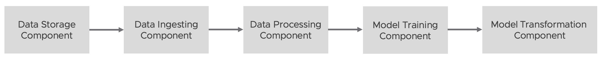
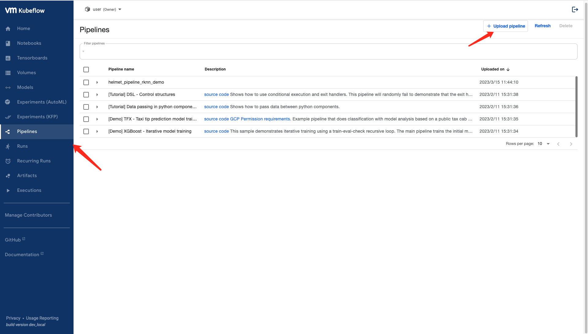
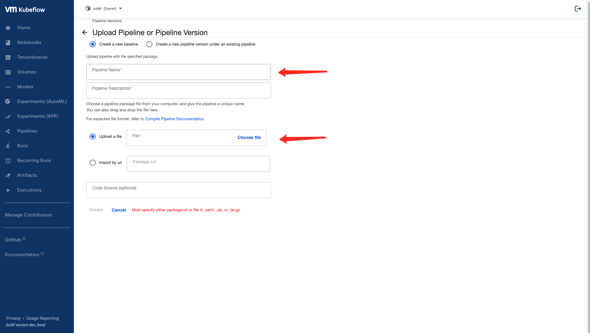
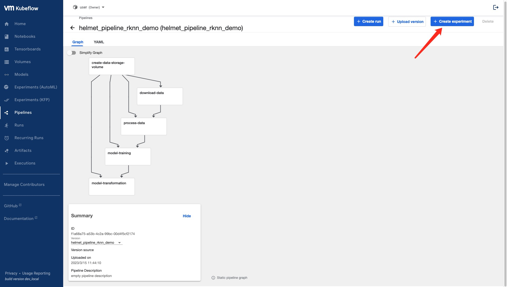
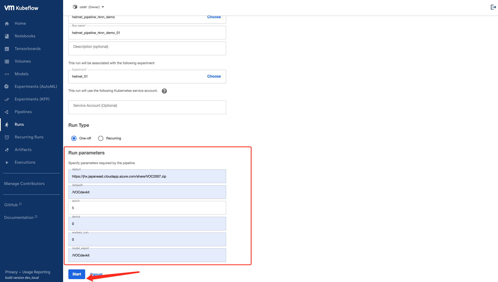
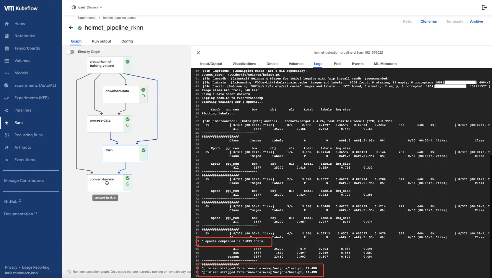

.. _helmet-pipeline:

=======================================
Model Deployment with Kubeflow Pipeline
=======================================

-----------
Intrduction
-----------

Kubeflow Pipelines is a platform for building and deploying portable, scalable machine learning (ML) workflows based on Docker containers. 
Each pipeline represents an ML workflow, and includes the specifications of all inputs needed to run the pipeline, as well the outputs of all components.
If you are not familar with the Kubeflow Pipeline, you can refer to :ref:`kubeflow_pipelines`.

In this tutorial, we would guide you through the Helmet Detction example (mentioned as the :ref:`helmet-notebook`) to build up and run Kubeflow pipelines

--------------------------
Design Pipeline Components
--------------------------

In this example, we would first containzernize each pipeline component as a docker image, and then build pipeline from these components’ images.

When Kubeflow Pipelines executes a component, a container image is started in a Kubernetes Pod and your component's inputs are passed in as command-line arguments.

Therefore, while designing pipeline components, we need to consider following issues:

* Which inputs can be passed to our component by value? And which inputs, which cannot be directly passed as a command-line argument, should be passed to your component by a reference to the input's path?
* To return an output from our component, the output's data must be stored as a file. We need to let Kubeflow Pipelines know what outputs our component produces, so that when our pipeline runs, Kubeflow Pipelines can pass the paths that we use to store our component’s outputs as inputs to our component.
* Since your inputs and output paths are passed in as command-line arguments, your component's code must be able to read inputs from the command line.

And in this example, specifically, a component specification should define:

* The component's inputs and outputs
* The container image that your component's code runs in, the command to use to run your component's code, and the command-line arguments to pass to your component’s code
* The component's metadata, such as the name and description

Note that here as we are going to build each component from docker images, *you do not need to run* following code blocks for train and evaluation in this notebook. We mainly guide you through the flow of each component design in this design section.

""""""""""""""""""""""""
Declare Input parameters
""""""""""""""""""""""""

Remember that when Kubeflow Pipelines executes a component, this component's inputs are passed in as command-line arguments. So here we need to define and parse the command-line arguments, using argparse.

.. code-block:: python

    parser = argparse.ArgumentParser()
    parser.add_argument('--dataurl', type=str)
    parser.add_argument('--datapath', type=str)

    args = vars(parser.parse_args())

    dataurl = args['dataurl']
    datapath = args['datapath']

In this example, the Train component takes these inputs as parameters: `dataurl`, `datapath`,
`patience`, `epochs`, `device`, `workers_num`, `model_export`.

You would need to specify these inputs before running this pipeline. We would discuss this more in details later in running pipeline section.

--------------
Build Pipeline
--------------

"""""""""""""""
Import Packages
"""""""""""""""

First, install the Pipeline SDK using the following command. If you run this command in a Jupyter notebook, restart the kernel after installing the SDK.

.. code-block:: bash

    $ pip install kfp --upgrade --user --quiet
    $ pip show kfp

.. code-block:: python

    import kfp
    import kfp.components as comp
    import kfp.dsl as dsl
    from kfp.components import OutputPath
    from typing import NamedTuple
    from kubernetes import client

"""""""""""""""""""""""""""""""""
Containernize Pipeline Components
"""""""""""""""""""""""""""""""""

We use Docker to build images. Basically, Docker can build images automatically by reading the instructions from a Dockerfile. A Dockerfile is a text document that contains all the commands a user could call on the command line to assemble an image.

Instructions and details of how to write a Dockerfile can be found on Docker's official docs.

In this example, we provide you with following Dockerfile for Train component and Evaluate component.

.. code-block:: bash

    FROM ubuntu:20.04

    # Downloads to user config dir
    ADD https://ultralytics.com/assets/Arial.ttf https://ultralytics.com/assets/Arial.Unicode.ttf /root/.config/Ultralytics/

    # Install linux packages
    RUN apt update
    RUN DEBIAN_FRONTEND=noninteractive TZ=Etc/UTC apt install -y tzdata
    RUN apt install --no-install-recommends -y python3-pip git zip curl htop libgl1-mesa-glx libglib2.0-0 libpython3.8-dev
    # RUN alias python=python3

    # Install pip packages
    COPY requirements.txt .
    RUN python3 -m pip install --upgrade pip wheel
    RUN pip install -r requirements.txt -i https://pypi.douban.com/simple/

    COPY . /

"""""""""""""""""""""""""""
Data Ingest Component
"""""""""""""""""""""""""""

.. code-block:: python

    def data_download_from_url(dataurl, datapath):
    vop = dsl.VolumeOp(name="create_helmet_data_storage_volume",
                       resource_name="helmet_data_storage_volume", size='10Gi', 
                       modes=dsl.VOLUME_MODE_RWO)

    return dsl.ContainerOp(
        name = 'Download Data', 
        image = 'harbor-repo.vmware.com/juanl/helmet_pipeline:v1',
        command = ['python3', 'ingest_pipeline.py'],
        arguments=[
            '--dataurl', dataurl,
            '--datapath', datapath
        ],
        pvolumes={
            '/VOCdevkit': vop.volume
        }
    )

First, we need to create and specify the persistent volume (PVC) for data storage, creating a VolumeOP instance.

    vop = dsl.VolumeOp(name="create_helmet_data_storage_volume",
                        resource_name="helmet_data_storage_volume", size='10Gi', 
                        modes=dsl.VOLUME_MODE_RWO)

We then create a ContainerOp instance, which would be understood and used as "a step" in our pipeline, and return this "step".

    return dsl.ContainerOp(
        name = \'Download Data\', 
        image = \'harbor-repo.vmware.com/juanl/helmet_pipeline:v1\',
        command = [\'python3\', \'ingest_pipeline.py\'],
        arguments=[
            \'--dataurl\', dataurl,
            \'--datapath\', datapath
        ],
        pvolumes={
            \'/VOCdevkit\': vop.volume
        }
    )

We need to specify the inputs (dataurl, datapath) in arguments, container image in image, and volume for data storage in pvolumes. Note that here in image, we provide you with our built images, containing both train folder and evaluate folder, stored on our projects.registry repo. If you want to use your own image, please remember to change this value.

We also need to specify command. In this provided case, as we containernize the image at root directory, in command we need python3 ingest_pipeline.py. (If you containernize Train component and Evaluate component one by one in each own folder, you may need to change this value to python3 ingest_pipeline.py.)

"""""""""""""""""""""""""
Data Processing Component
"""""""""""""""""""""""""

.. code-block:: python

    def data_process(comp1):
        return dsl.ContainerOp(
            name = 'Process Data', 
            image = 'harbor-repo.vmware.com/juanl/helmet_ingest_data:v1',
            command = ['python3', 'prepare.py'],
            pvolumes={
                '/VOCdevkit': comp1.pvolumes['/VOCdevkit']
            }
        )

""""""""""""""""""""""""
Model Training Component
""""""""""""""""""""""""

.. code-block:: python

    def model_train(comp2, epoch, device, workers_num, model_export):
    return dsl.ContainerOp(
        name = 'Model Training',
        image = 'harpersweet/helmet_pipeline:v2',
        pvolumes={
            '/VOCdevkit': comp2.pvolumes['/VOCdevkit']
        },
        # command=['sh', '-c'],
        # arguments=['nvidia-smi'],
        command = ['python3', 'train_pipeline.py'],
        arguments=[
            '--epoch', epoch,
            '--device', device,
            '--workers', workers_num,
            '--output_dir', model_export
        ],
    ).set_gpu_limit(1).set_cpu_request('2').set_memory_request('8G')

"""""""""""""""""
Generate Pipeline
"""""""""""""""""

.. code-block:: python

    @dsl.pipeline(
    name = 'helmet detection pipeline',
    description = 'pipeline to detect helmet')
    def generate_pipeline(dataurl, datapath, epoch, device, workers_num, model_export):
        comp1 = data_download_from_url(dataurl, datapath)
        comp2 = data_process(comp1)
        comp3 = model_train(comp2, epoch, device, workers_num, model_export)
        comp4 = convert_to_rknn_model(comp3)

    if __name__ == '__main__':
    import kfp.compiler as compiler
    compiler.Compiler().compile(generate_pipeline, './generated_yaml_files/helmet_pipeline_demo' + '.yaml')

------------
Run Pipeline
------------

In the example, we compiled the pipeline as a YAML file. So here we provide you with a brief guide on how to run a pipeline.

""""""""""""""""""""""""""""""""""
Upload the pipeline to Kubeflow UI 
""""""""""""""""""""""""""""""""""

Following our notebook, you should be able to see a file called helmet_pipeline_demo.yaml. 
we provide you with a already-compiled pipeline YAML files for quick-test purpose. If you prefer that, feel free to skip to pipeline running part and use them.
Upload the yaml file to Pipelines on Kubeflow UI.

"""""""""""""""""""""""""
Create experiment and run 
"""""""""""""""""""""""""

Create an experiment for this pipeline, and create a run. This time, you need to provide two inputs, dataset and data_path, exactly the ones for our first step Data Download. If you do not intend to make any personalization on datasets and data path, enter following values

""""""""""""""""""""""
Check logs and outputs 
""""""""""""""""""""""

